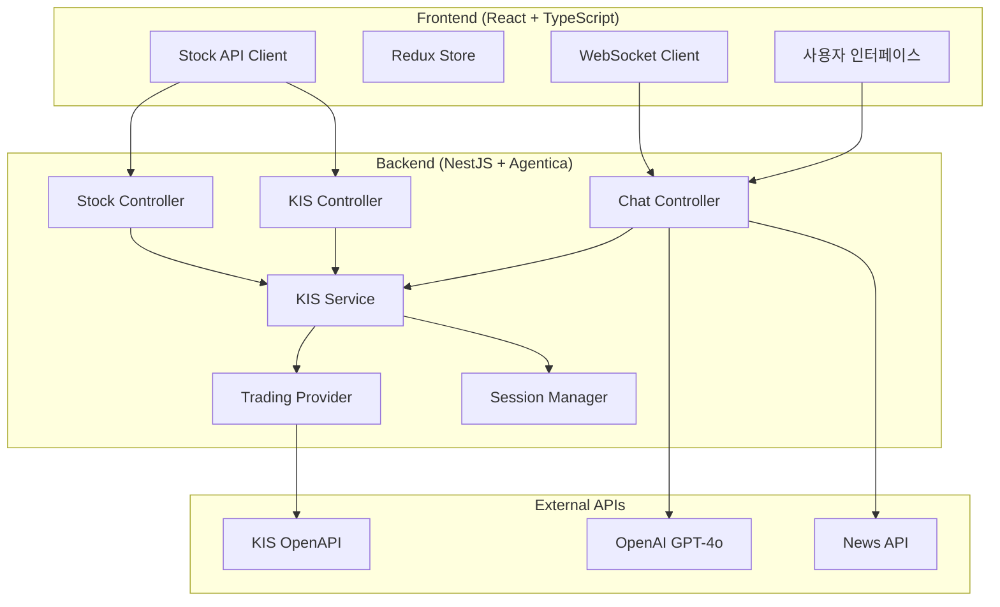
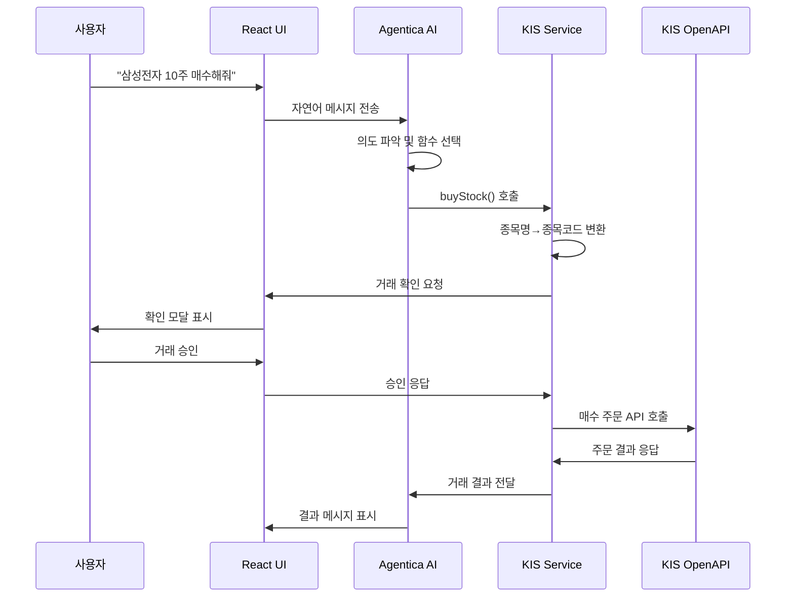
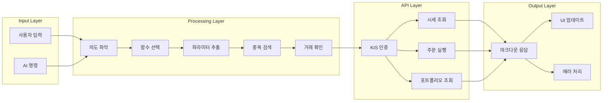
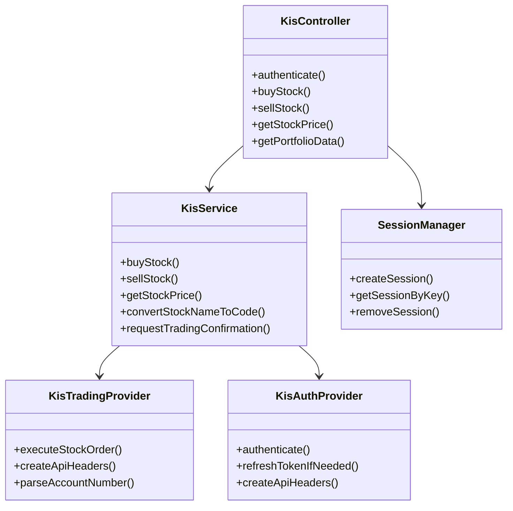
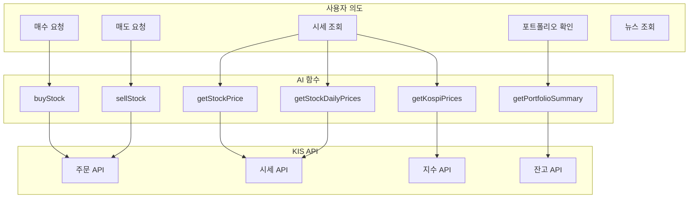
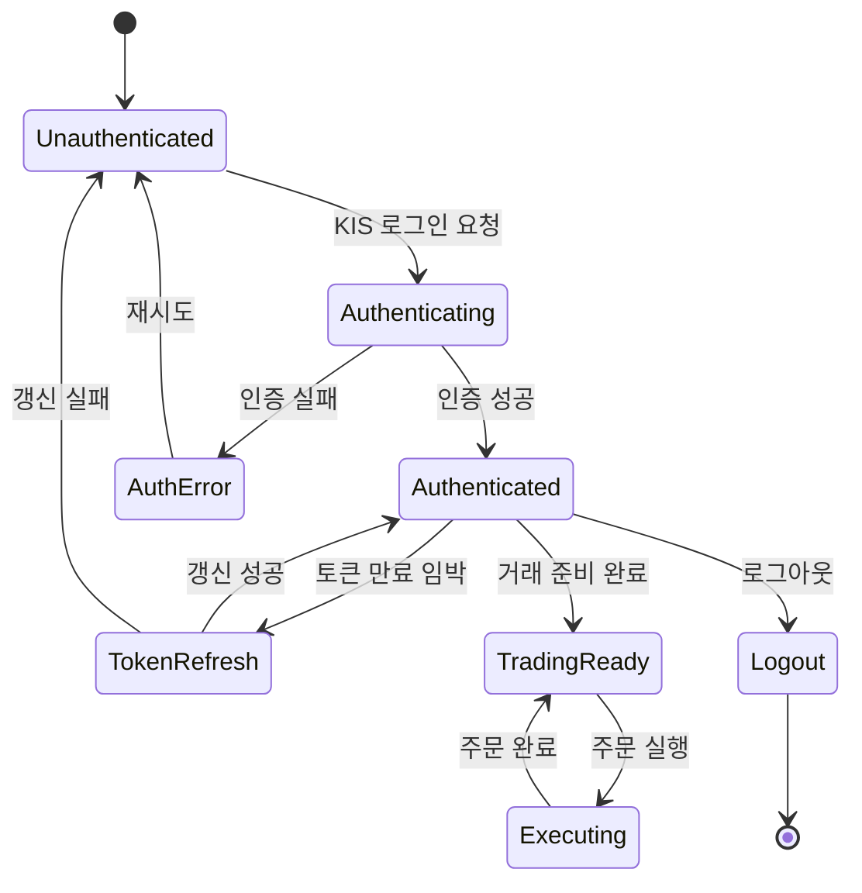
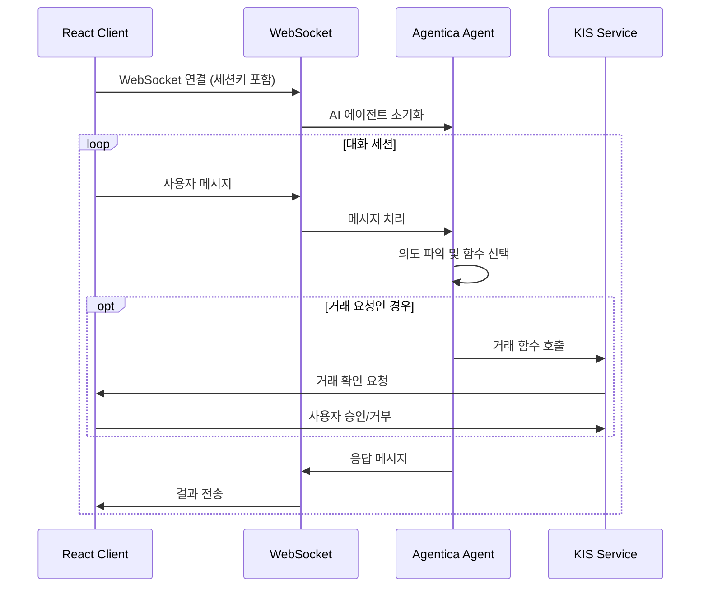
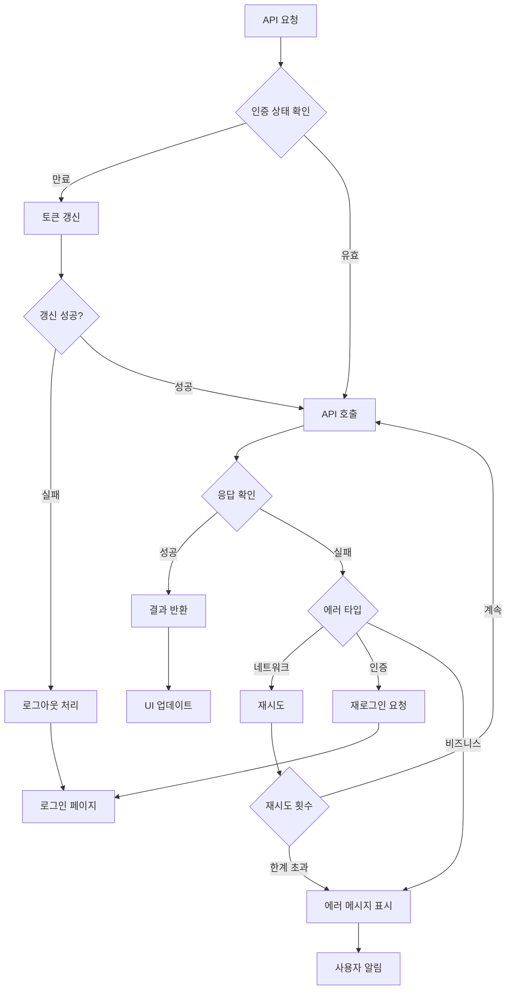
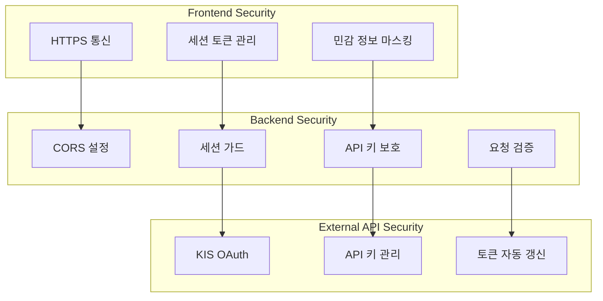
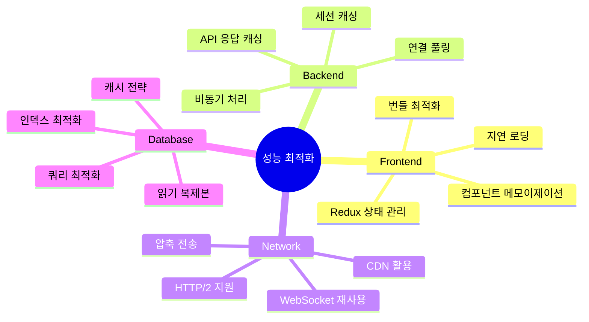

# Investica 시스템 아키텍처 다이어그램

## 1. 전체 시스템 아키텍처

## 2. 주식 거래 플로우

## 3. 데이터 흐름 다이어그램

## 4. KIS API 통합 구조

## 5. Agentica AI 함수 매핑

## 6. 세션 및 인증 관리

## 7. 실시간 통신 구조

## 8. 에러 처리 및 복구 전략

## 9. 보안 레이어 구조

## 10. 성능 최적화 전략

